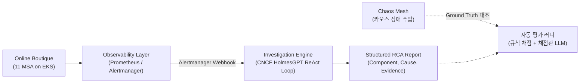

# 🚀 Kubernetes 환경의 AIOps 진단 평가 자동화 및 실패 분석 기반 점진적 개선
> **영문 명칭:** Kubernetes AIOps RCA Benchmark Automation & Failure-Driven Improvement Platform  
> **핵심 키워드:** Kubernetes, Observability, Agentic RCA, Chaos Engineering, Automated Benchmark, AIOps / SRE

> [!NOTE]
> **Workload & Open Source Attribution:**  
> 본 프로젝트는 Google Cloud의 [Online Boutique (microservices-demo)](https://github.com/GoogleCloudPlatform/microservices-demo)를 대상 마이크로서비스 워크로드로 활용하고, CNCF의 오픈소스 [HolmesGPT](https://holmesgpt.dev/)를 조사 엔진으로 사용합니다.  
> 클라우드 인프라(Terraform on AWS EKS), 관측 계층, 카오스 장애 주입 시나리오, Ground Truth 다면 채점기 및 자동화 벤치마크 평가 파이프라인은 본 프로젝트에서 자체적으로 설계·구현을 진행 중입니다.

---

## 1. 🎯 프로젝트 개요 (Executive Summary)

**"오픈소스 AIOps 도구를 단순히 설치하는 것만으로는 실제 프로덕션 장애 대응에서 신뢰할 수 있는지 객관적으로 판단할 수 없습니다."**

본 프로젝트는 Kubernetes 환경에 재현 가능한 카오스 장애를 주입하고, **장애 원인을 모르는 조사 에이전트(HolmesGPT)의 블라인드 진단 결과**를 **사전에 설계된 정답(Ground Truth) 기반의 평가 엔진(규칙 채점 + 채점관 LLM)으로 자동 채점·분석하는 벤치마크 시스템**을 구축합니다.

### 🔄 핵심 역할 분담 및 동작 구조
* **조사 에이전트 (HolmesGPT + 추론 LLM):**  
  장애 정답을 모르는 블라인드 상태에서 Alertmanager 경보를 수신합니다. 클러스터 메트릭, 로그(`kubectl` 및 연동 도구)를 능동적으로 탐색(ReAct Loop)하여 추정 원인, 영향 범위, 진단 근거(Evidence), 조치 권고를 담은 **RCA 진단 보고서**를 산출합니다.
* **평가 러너 & 채점관 (Benchmark Runner + 채점관 LLM):**  
  실제 주입된 결함의 **정답(Ground Truth) 메타데이터**와 원천 텔레메트리를 대조하여 다면 채점합니다. 원인 일치는 규칙으로 채점하고 근거 타당성은 기준표(Rubric) 기반 LLM으로 평가하며, 판정이 모호한 사례는 사람이 직접 교차 검토합니다. 공정한 평가를 위해 실험군(도구 구성명)을 가린 블라인드 평가를 원칙으로 합니다.
* **실패 분석 기반 표적 개선 (Failure-Driven Iteration):**  
  기본 베이스라인에서 발생하는 실패 사례를 체계적으로 분류하고, 분석된 원인에 맞춰 필요한 관측 데이터(중앙 로그, 분산 트레이스 등) 및 도메인 지식(런북)을 단계별로 보완하며 전후 성능 변화를 실측 검증합니다.

---

## 2. 💡 문제 정의 및 해결 접근법 (Problem Definition & Approach)

### 기존 접근법의 한계
1. **임계치 모니터링의 한계:** 수많은 연쇄 알람(Alert Storm) 발생 시, 엔지니어가 수많은 대시보드를 오가며 최초 발화 지점과 원인을 수동 추적해야 함.
2. **단순 프롬프트 요약의 한계:** 정적 경보 텍스트만 요약하는 방식은 최신 텔레메트리를 능동적으로 검증할 수 없어 할루시네이션 및 오진 위험이 큼.
3. **정성적 데모 중심의 한계:** AIOps 도구를 도입할 때 몇 가지 성공 사례만을 보여주는 단편적 시연에 의존하여, 어떤 유형의 장애에서 실패하고 어떤 데이터가 실제로 필요한지 객관적으로 검증하기 어려움.

### 본 프로젝트의 해결 접근법: 2단계 점진적 검증
1. **[1단계] 자동화 평가 환경 구축 및 기준 성능(Baseline) 측정:**  
   - Chaos Mesh 장애 주입 ➡️ 경보 인입 ➡️ HolmesGPT 자율 조사 ➡️ Ground Truth 자동 채점 ➡️ 클러스터 복구로 이어지는 E2E 자동화 러너 구축
   - 기본 베이스라인(`kubectl` 기본 파드 로그 + Prometheus 메트릭) 구성에서의 기준 정확도, TTD, 비용 측정
2. **[2단계] 실패 분석에 따른 표적 개선 및 전후 비교 실측:**  
   - 베이스라인 실패 로그 및 도구 호출 궤적(Trajectory)을 체계적으로 분류
   - 진단 실패를 유발한 원인에 맞춰 필요한 모니터링 도구(중앙 로그 수집기, 분산 트레이싱 등) 및 마이크로서비스 런북을 선별 추가하며 성능 개선 및 부작용(비용/지연 증가)을 실측 비교

---

## 3. 🏗️ 시스템 아키텍처 (System Architecture)



```text
┌────────────────────────────────────────────────────────────────────────┐
│                        Kubernetes Workload Layer                       │
│  - Online Boutique (11 Microservices) + Locust 부하 생성기             │
└───────────────────────────────────┬────────────────────────────────────┘
                                    │ Telemetry Streaming
┌───────────────────────────────────▼────────────────────────────────────┐
│                       Observability & Alerts Layer                     │
│  - Baseline: Prometheus / Alertmanager (메트릭 수집 및 경보 인입)        │
│  - 기본 로그: kubectl logs (파드 표준 출력 로그)                         │
│  - 점진적 확장(예정): 실패 분석 결과에 따라 필요한 모니터링 도구 선별 추가  │
└───────────────────────────────────┬────────────────────────────────────┘
                                    │ Webhook / Alert Event
┌───────────────────────────────────▼────────────────────────────────────┐
│                  Autonomous Investigation Engine                       │
│  [ CNCF HolmesGPT : Alert 인입 → ReAct 조사 → 근거 수집 → RCA 도출 ]   │
│   • Baseline: kubectl (파드 상태/이벤트/최근로그) + PromQL               │
│   • 점진적 확장: 실패 원인 분석에 기반한 모니터링 도구 연동 및 런북(Runbooks)│
└───────────────────┬────────────────────────────────────────────────────┘
                    │ Structured RCA Report (Root Cause, Evidence, Actions)
┌───────────────────▼────────────────────────────────────────────────────┐
│              Continuous Evaluation & Benchmark Engine                  │
│  [시나리오 관리]  탐색용 세트(개선용) / 검증용 홀드아웃 세트 사전에 엄격 분리   │
│  [예외 처리]      장애 미발생(무효), 경보 미인입(타임아웃), 복구 실패 대응    │
│  [다면 채점]      규칙 기반 원인 일치 채점 + 블라인드 채점관 LLM 근거 검토    │
│  [측정 지표]      핵심 지표(정확도, 근거 타당성, TTD, 토큰 비용) 실측      │
└───────────────────▲────────────────────────────────────────────────────┘
                    │ Fault Injection & Clean State Reset
┌───────────────────┴────────────────────────────────────────────────────┐
│                     Chaos Engineering Platform                         │
│  - Chaos Mesh (Network Delay/Loss, Pod Kill, CPU/Memory Stress 등)     │
└────────────────────────────────────────────────────────────────────────┘
```

---

## 4. 🧪 정밀 Ground Truth 설계 및 평가 체계 (Evaluation Framework)

### 1) 인과관계를 반영한 Ground Truth 메타데이터 구조
단순 결함 주입 위치와 실제 장애 증상을 혼동하지 않도록 5단계 인과관계 필드로 정형화합니다:
* **주입 대상 (Injection Target):** 실제로 결함이 투입된 컴포넌트 및 리소스 (예: `redis-cart` 파드)
* **원인 결함 유형 (Fault Type):** 구체적인 장애 메커니즘 (예: `Network Delay (2000ms)`, `OOMKilled`)
* **근본 원인 컴포넌트 (Root Cause Component):** **[1차 채점 대상]** 실질적 장애의 원인이 되는 컴포넌트 (예: `redis-cart` 캐시 인프라, `cartservice` 애플리케이션 등)
* **증상 발현 서비스 (Symptom Service):** 연결 실패/타임아웃으로 에러가 처음 표출된 마이크로서비스 (예: `cartservice`)
* **연쇄 영향 범위 (Affected Services):** 최종 사용자 관점에서 장애가 전파된 서비스 목록 (예: `[frontend]`)

### 2) 평가 러너의 예외 및 실패 처리 (Edge Cases)
평가 결과가 긍정적으로 편향되는 것을 방지하기 위해 파이프라인 전 과정의 실패를 명시적으로 집계합니다:
* **장애 미발생 (Fault Ineffective):** 카오스 주입 후 메트릭/에러율 변화가 기준치 미달 시 ➡️ **실험 무효(Invalid)** 처리 및 파라미터 재조정
* **경보 미발생 (Alert Missed):** 장애는 정상 유발되었으나 제한 시간 내 Alertmanager 경보가 오지 않음 ➡️ **경보 타임아웃**으로 기록하고, 규칙(임계치)·수집 지연·전달 오류 등 단계별 원인을 별도 분석
* **조사 실패/시간 초과 (Investigation Timeout):** 에이전트 루프 비정상 종료 또는 타임아웃 ➡️ **진단 실패(Failure)**로 집계
* **클러스터 복구 실패 (Recovery Failed):** 장애 주입 해제 후 파드 정상화 실패 시 ➡️ **후속 실험 중단**, 클러스터 상태 복구 후 재개

### 3) 채점 방식 및 측정 지표
* **다면 채점 및 검증 체계:**
  - **원인 일치 규칙 채점:** 근본 원인 컴포넌트(Root Cause Component) 및 결함 유형 일치 여부는 Ground Truth와 1:1 비교하여 규칙(Rule)으로 자동 채점합니다.
  - **기준표 기반 LLM 평가:** 진단 근거(Evidence)의 타당성과 조치 권고의 적절성은 사전 정의된 평가 기준표(Rubric)에 따라 채점관 LLM을 활용합니다.
  - **인간 교차 검증 (Human-in-the-Loop):** 채점관 LLM의 평가 오류를 방지하기 위해, 일부 무작위 표본 및 판정이 모호한 경계 사례는 사람이 직접 교차 검토하여 채점 신뢰성을 확인합니다.
  - **블라인드 평가 원칙:** 채점 시 보고서의 실험군 식별자(도구 구성명)를 가리는 것을 원칙으로 하되, 본문에 특정 도구(LogQL 등)가 언급되어 간접 유추될 수 있음을 고려하여 정답 및 텔레메트리 원천 증거 중심의 객관적 평가를 수행합니다.
* **핵심 지표 (Primary Metrics):**
  1. **원인 식별 정확도 (Accuracy):** Top-1 및 Top-k 근본 원인 컴포넌트(Root Cause Component) 및 원인 결함 유형 일치율
  2. **진단 근거 타당성 (Evidence Grounding):** 올바른 메트릭/로그 지표를 실제 근거로 제시했는지 여부 (기준표 기반 검토)
  3. **진단 소요 시간 (Time to Diagnosis, TTD):** 경보 인입부터 최종 리포트 도출까지의 시간
  4. **경제성 및 비용 (Token Cost):** 진단 1건당 소모된 입/출력 토큰 및 API 비용
* **보조/확장 지표 (Secondary Metrics):** 영향 범위(Blast Radius) 식별율 (별도 에러율/지연 임계치 기준 적용), 도구 호출 효율성

---

## 5. 🔍 체계적인 실패 분류 (Failure Taxonomy)

기본 베이스라인의 진단 실패 원인을 4가지 상위 범주로 분석하여 맞춤형 개선안을 도출합니다:

| 실패 분류 | 세부 원인 및 예시 | 표적 개선 방안 |
| :--- | :--- | :--- |
| **정보 부족 (Information Gap)** | 파드 재시작으로 이전 로그 유실, 분산 트레이스 부재, 설정/배포 변경 이력 부재 | 실패 원인에 따른 **중앙 로그 수집기 및 분산 트레이싱 등 선별 도입** |
| **조회 실패 (Retrieval Failure)** | 권한 부족, 잘못된 시간 범위(Time window) 쿼리, 네임스페이스/라벨 불일치 | 쿼리 가이드라인 및 도구 파라미터 최적화 |
| **해석·추론 실패 (Reasoning Failure)** | 필요한 증거는 수집했으나 상관관계를 인과관계로 오판, 서비스 의존성 오해 | **마이크로서비스 의존성 런북(Runbooks)** 가이드 주입 |
| **실행 실패 (Execution Failure)** | 에이전트 도구 호출 문법 에러, 타임아웃, 출력 포맷 불일치 | 시스템 프롬프트 및 스키마 검증 보완 |

---

## 6. 🔬 단계적 비교 검증 설계 및 통계 원칙 (Iterative Evaluation Plan)

모든 개선은 **탐색용 세트(Exploration Set)**를 바탕으로 한 번에 한 가지 조건만 변경(단일 변인 통제)하며 전후 변화를 측정합니다.

### 1) 홀드아웃 세트 운영 원칙
* 시나리오를 **개선용 탐색 세트**와 **검증용 홀드아웃 세트**로 사전에 철저히 분리합니다.
* 검증용 홀드아웃 세트는 모든 설계가 확정된 후 최종 평가에만 사용합니다. 만약 홀드아웃 결과를 확인한 뒤 설계를 수정할 경우, 해당 세트는 탐색용으로 전환하고 **새로운 홀드아웃 시나리오를 추가 확보**하여 일반화 성능을 재검증합니다.

### 2) 통계적 신뢰성 확보
* 고정된 반복 횟수를 단정하지 않고, **예비 실험을 통해 지표 변동성(분산)을 확인한 뒤 통계적으로 유의미한 표본 수를 결정**합니다.
* 최종 결과는 단순 평균값뿐만 아니라 **표준편차와 변동성을 함께 보고**합니다.

### 3) 실패 분석에 따른 표적 개선 가설 (예시)
* **[가설 1] 로그 유실/과거 이력 부재로 실패한 경우:** `기본 파드 로그(kubectl logs)` 단독 환경 vs `중앙 집중형 로그 수집 도구` 연동 환경 비교
* **[가설 2] 분산 서비스 간 연쇄 지연 추적에 실패한 경우:** 메트릭 단독 환경 vs `분산 트레이싱 도구` 연동 환경 비교
* **[가설 3] 서비스 의존성 오판으로 엉뚱한 파드를 탐색한 경우:** 도구 단독 환경 vs `MSA 의존성 런북(Runbooks)` 주입 환경 비교

---

## 7. 💻 기술 스택 구성 (Technology Stack)

| 구분 | 도입 기술 | 역할 및 상세 |
| :--- | :--- | :--- |
| **Target Workload** | Google Online Boutique, Locust | 11개 마이크로서비스 워크로드 및 사용자 부하 생성기 |
| **Observability** | Prometheus, Alertmanager | 기본 메트릭 수집 및 경보 인입 (실패 분석에 따라 모니터링 도구 단계적 추가 예정) |
| **Investigation Engine** | **CNCF HolmesGPT**, Python | ReAct 자율 조사 루프 실행 및 클러스터 연동 (오픈소스 그대로 활용) |
| **Domain Knowledge** | Markdown/YAML Runbooks | 마이크로서비스 의존성 토폴로지 및 운영 가이드 |
| **Chaos & Benchmark** | Chaos Mesh, Python Benchmark Runner | 카오스 결함 주입 및 Ground Truth 기반 자동 평가 파이프라인 |
| **Infra & DevOps** | AWS EKS, Terraform, `fck-nat`, Helm | FinOps 최적화 선언적 인프라 프로비저닝 |

---

## 8. 🚀 빠른 시작 (Quick Start)

### 1. 클라우드 인프라 프로비저닝 (Terraform)
```bash
cd terraform/envs/dev
terraform init
terraform plan
terraform apply
```

### 2. EKS 클러스터 접속 설정
```bash
aws eks update-kubeconfig --region ap-northeast-2 --name msa-demo-dev-eks
kubectl get nodes -o wide
```

### 3. 마이크로서비스 배포 (Online Boutique)
```bash
helm upgrade --install onlineboutique ./helm-chart \
  --namespace onlineboutique \
  --create-namespace
```

---

## 9. 📅 단계별 구현 로드맵 (Phased Roadmap)

| 단계 | 주요 작업 목표 | 상태 |
| :--- | :--- | :---: |
| **Phase 0: Baseline Infra** | • AWS EKS 인프라 프로비저닝 & Online Boutique 워크로드 구성<br>• 원클릭 클러스터 프로비저닝/삭제(IaC) 파이프라인 안정화 | **진행 중** |
| **Phase 1: 장애·평가 파이프라인 구축** | • Prometheus 메트릭 수집 및 Alertmanager Webhook 연동<br>• HolmesGPT 기본 연동 (`kubectl` + Prometheus)<br>• Chaos Mesh 배포 및 Ground Truth 자동 평가 러너 초기 구현<br>• 탐색용/홀드아웃 장애 시나리오 사전 정의 | 진행 예정 |
| **Phase 2: 기준 성능 측정 & 실패 분류** | • 기본 베이스라인 상태에서 탐색 세트 벤치마크 수행<br>• 4대 실패 범주(정보 부족, 조회 실패, 추론 실패, 실행 실패)에 따른 체계적 분류 | 예정 |
| **Phase 3: 표적 개선 (Targeted Improvement)** | • 실패 분석 결과에 맞춰 필요한 모니터링 도구(중앙 로그, 분산 트레이스 등) 및 런북 단계적 연동<br>• 단일 변인 통제 환경에서 전후 비교 평가 및 지표 실측 | 예정 |
| **Phase 4: 최종 평가 & 결과 종합 분석** | • 최종 확정 구성으로 검증용 홀드아웃 세트 평가 수행<br>• 표본 수 및 지표 변동성을 반영한 최종 벤치마크 통계 보고서 도출 | 예정 |

---

## 10. 🔗 참고 자료 (References)

* [Google Cloud Online Boutique](https://github.com/GoogleCloudPlatform/microservices-demo)
* [CNCF HolmesGPT Official Documentation](https://holmesgpt.dev/)
* [Chaos Mesh Documentation](https://chaos-mesh.org/docs/)
